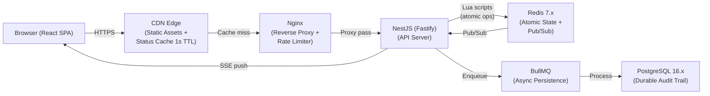

# Flash Sale System

A high-concurrency flash sale system designed to sell ~100 units of a single product to 1,000+ concurrent users without overselling, duplicate purchases, or data corruption. Built with atomic Redis Lua scripts for sub-millisecond purchase decisions and asynchronous PostgreSQL persistence for durable audit trails.

---

## Architecture



**Key design principle**: Purchase decisions are made entirely within a Redis Lua script (~0.5ms), ensuring atomic check-state → check-stock → decrement → record-buyer operations. PostgreSQL persistence happens asynchronously via BullMQ, with a reconciliation cron to guarantee eventual consistency.

---

## Tech Stack

| Layer           | Technology                                 | Purpose                                                     |
| --------------- | ------------------------------------------ | ----------------------------------------------------------- |
| **Frontend**    | React 19 + Vite                            | Single-page application with real-time SSE updates          |
| **Backend**     | NestJS 11 + Fastify                        | API server with ~2x Express throughput                      |
| **State Store** | Redis 7                                    | Atomic purchase operations via Lua scripts + Pub/Sub        |
| **Database**    | PostgreSQL 16                              | Durable audit trail with UNIQUE constraint defense-in-depth |
| **Queue**       | BullMQ                                     | Async Redis→PostgreSQL persistence with retry + DLQ         |
| **Proxy**       | Nginx                                      | Rate limiting (100 req/s per IP) + SSE support              |
| **Monorepo**    | pnpm workspaces + Turborepo                | Workspace management + parallel task execution              |
| **Testing**     | Jest 30 + Testcontainers + Playwright + k6 | Unit, integration, E2E, and stress testing                  |
| **CI/CD**       | GitHub Actions                             | Lint → Unit → Integration → E2E → Stress → Build            |

---

## Quick Start

### Prerequisites

- [Node.js](https://nodejs.org/) 22+ (LTS)
- [pnpm](https://pnpm.io/) 9.15+
- [Docker](https://www.docker.com/) 24+ with Compose v2

### Setup

```bash
# Clone and install
git clone <repository-url>
cd flash-sale
pnpm install

# Copy environment files
cp apps/backend/.env.example apps/backend/.env
cp apps/frontend/.env.example apps/frontend/.env

# Start infrastructure (Redis + PostgreSQL)
cd infrastructure/docker && docker compose up -d redis postgresql && cd ../..

# Start backend (watches for changes)
pnpm --filter backend start:dev

# Start frontend (in another terminal)
pnpm --filter frontend dev
```

### Create a Test Sale

```bash
curl -X POST http://localhost:3000/api/v1/products \
  -H "Content-Type: application/json" \
  -H "X-Admin-Key: dev-admin-key-12345678" \
  -d '{
    "sku": "WIDGET-001",
    "productName": "Limited Edition Widget",
    "initialStock": 100,
    "startTime": "2026-02-15T10:00:00.000Z",
    "endTime": "2026-02-15T10:30:00.000Z"
  }'
```

Open `http://localhost:5173` to see the frontend. See the [Getting Started guide](docs/04_getting_started.md) for full instructions.

---

## API Overview

### Public Endpoints

| Method | Endpoint               | Description                                       |
| ------ | ---------------------- | ------------------------------------------------- |
| `GET`  | `/api/v1/sales`        | Sale status + stock count (CDN-cacheable, 1s TTL) |
| `POST` | `/api/v1/purchases`    | Attempt purchase (atomic via Lua script)          |
| `GET`  | `/api/v1/purchases`    | Check user's purchase status                      |
| `GET`  | `/api/v1/sales/events` | SSE stream for real-time updates                  |
| `GET`  | `/health`              | Health check (Redis + PostgreSQL status)          |

### Admin Endpoints

| Method   | Endpoint                | Description                            |
| -------- | ----------------------- | -------------------------------------- |
| `POST`   | `/api/v1/products`      | Create product with sale configuration |
| `GET`    | `/api/v1/products/:sku` | Get product details + stock status     |
| `PUT`    | `/api/v1/products/:sku` | Update product (only when UPCOMING)    |
| `DELETE` | `/api/v1/products/:sku` | Delete product + sale data             |

All admin endpoints require `X-Admin-Key` header. See [System Design](docs/02_system_design.md#2-api-contract) for the full API contract.

---

## Testing

| Type                         | Command                                                               | Infrastructure                                 |
| ---------------------------- | --------------------------------------------------------------------- | ---------------------------------------------- |
| **All (unit + integration)** | `pnpm turbo test`                                                     | Docker (Testcontainers auto-starts containers) |
| **Unit only**                | `pnpm --filter backend test -- --testPathPatterns="test/unit"`        | None                                           |
| **Integration only**         | `pnpm --filter backend test -- --testPathPatterns="test/integration"` | Docker (Testcontainers auto-starts containers) |
| **E2E**                      | `pnpm --filter frontend exec playwright test`                         | Docker Compose + running backend + frontend    |
| **Stress**                   | `./apps/backend/test/stress/scripts/run-stress.sh`                    | Docker Compose + running backend               |

Stress tests verify concurrency with 1,000 virtual users: exactly 100 purchases succeed, 900 are rejected, zero overselling. See the [Stress Testing guide](docs/05_stress_testing.md) for details.

---

## Project Structure

```
flash-sale/
├── apps/
│   ├── backend/                    # NestJS + Fastify API
│   │   ├── src/
│   │   │   ├── core/domain/        # Entities, VOs, events, services
│   │   │   ├── application/        # Use cases, ports, DTOs
│   │   │   ├── infrastructure/     # Redis, PostgreSQL, BullMQ, rate limiting
│   │   │   └── presentation/       # Controllers, guards, middleware, SSE
│   │   └── test/                   # Unit, integration, stress tests
│   └── frontend/                   # React 19 + Vite SPA
├── packages/
│   └── shared/                     # Shared types and constants
├── infrastructure/
│   └── docker/                     # Docker Compose, Nginx, Redis, PostgreSQL configs
├── docs/                           # Documentation
└── .github/workflows/              # CI/CD pipelines
```

---

## Documentation

| Document                                        | Description                                                        |
| ----------------------------------------------- | ------------------------------------------------------------------ |
| [Requirements](docs/01_requirements.md)         | Functional and non-functional requirements                         |
| [System Design](docs/02_system_design.md)       | Architecture, API contract, data model, bottleneck analysis        |
| [Design Decisions](docs/03_design_decisions.md) | Trade-offs, deviations from plan, technology choices               |
| [Getting Started](docs/04_getting_started.md)   | Build, run, and deploy instructions (local/staging/production)     |
| [Stress Testing](docs/05_stress_testing.md)     | Stress test guide with expected results and invariant verification |

---

## License

This project is licensed under the [MIT License](LICENSE).
