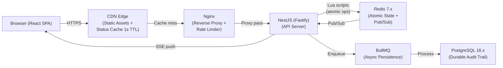
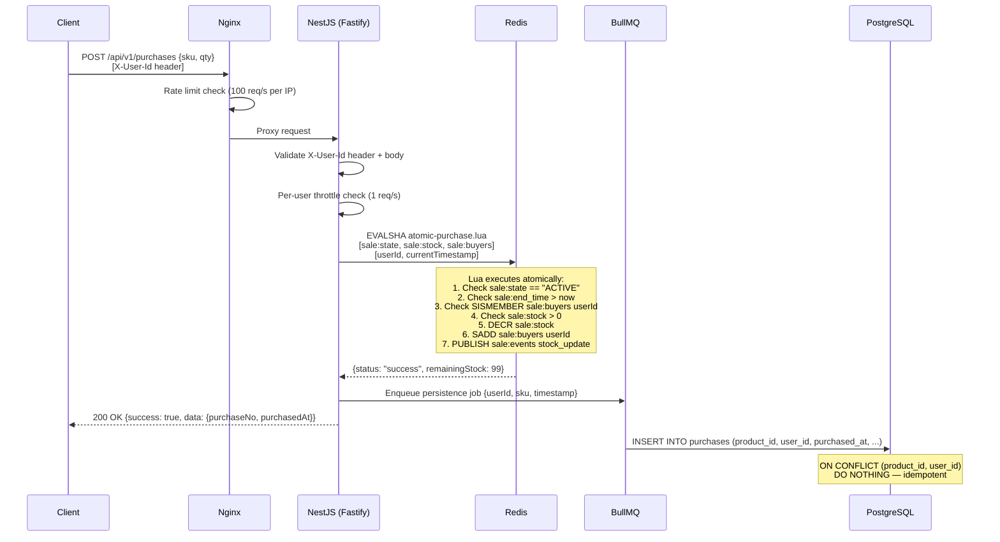
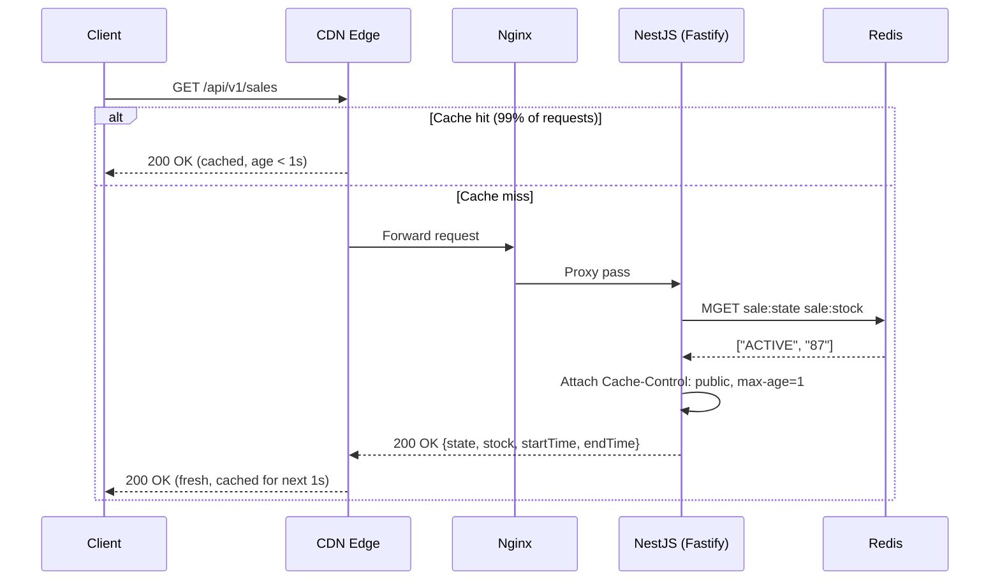
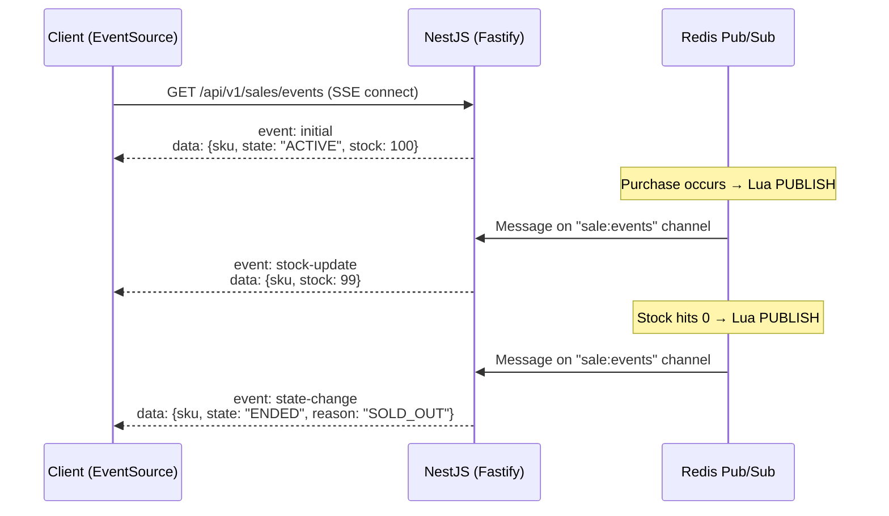
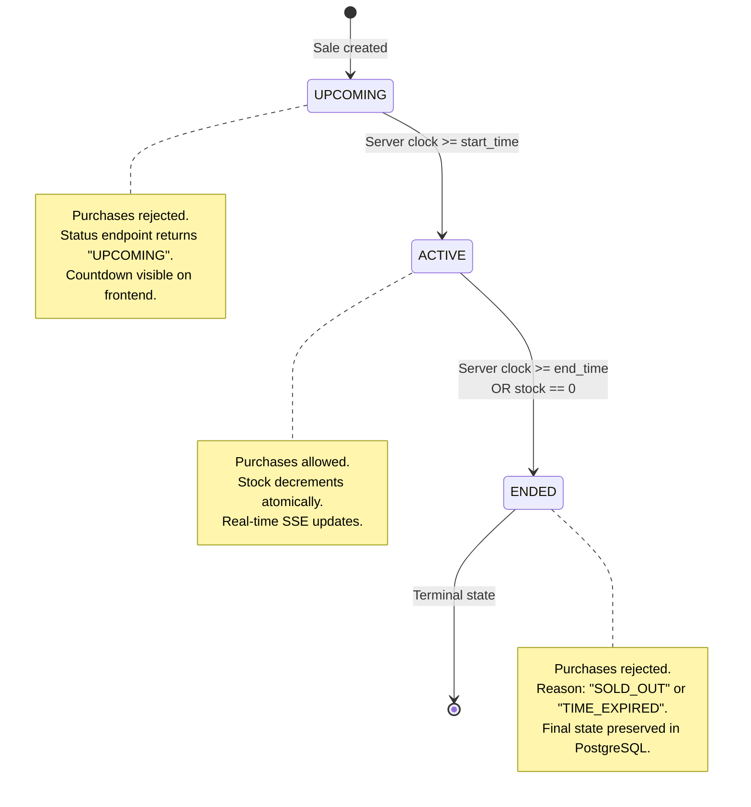
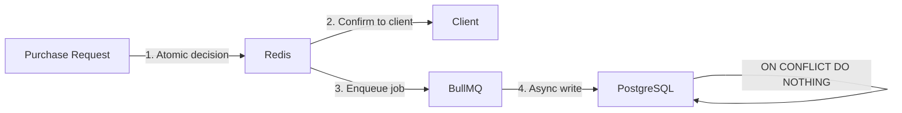
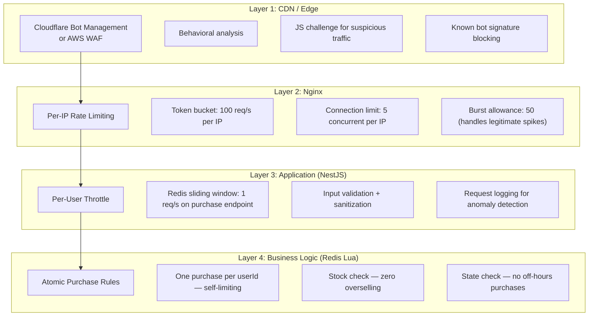

# System Design

## Table of Contents

1. [High-Level Design](#1-high-level-design)
2. [API Contract](#2-api-contract)
3. [Data Model Deep Dive](#3-data-model-deep-dive)
4. [Bottlenecks & Trade-offs](#4-bottlenecks--trade-offs)
5. [Abuse Prevention & Traffic Management](#5-abuse-prevention--traffic-management)
6. [Acceptance Criteria Traceability](#6-acceptance-criteria-traceability)

---

## 1. High-Level Design

### 1.1 Architecture Overview

The system is built for a single mission: **sell ~100 units of a single product to 1,000–10,000 concurrent users without overselling, duplicate purchases, or data corruption**. Every architectural decision flows from this constraint.



### 1.2 Component Justification

| Component            | Role                                            | Why This Choice                                                                                                                                                 |
| -------------------- | ----------------------------------------------- | --------------------------------------------------------------------------------------------------------------------------------------------------------------- |
| **React SPA**        | Single-page frontend                            | Required by assessment. Displays sale state, stock count, and purchase form.                                                                                    |
| **CDN Edge**         | Static asset delivery + status endpoint caching | Absorbs 99% of read traffic via 1s TTL cache. Keeps origin servers focused on write-path (purchase) operations. Addresses NF-12.                                |
| **Nginx**            | Reverse proxy + per-IP rate limiting            | Token bucket rate limiting at the edge (100 req/s per IP). Connection limiting protects against FD exhaustion. Addresses NF-10, NF-11.                          |
| **NestJS + Fastify** | Application server                              | NestJS provides structure (DI, decorators, guards, modules) for maintainable code. Fastify adapter gives ~2x throughput vs Express. TypeScript required by D-1. |
| **Redis 7.x**        | Authoritative hot-path state store              | Single-threaded Lua script execution guarantees atomic check-and-decrement. All purchase decisions happen here in ~0.5ms. Addresses NF-7, NF-8, NF-9.           |
| **BullMQ**           | Async job queue                                 | Decouples the fast purchase confirmation (Redis) from the durable write (PostgreSQL). Provides retry + DLQ for failed persistence.                              |
| **PostgreSQL 16.x**  | Durable audit trail                             | ACID-compliant storage for purchase records. `UNIQUE` constraint provides defense-in-depth against duplicate purchases. Addresses NF-4, NF-6.                   |

### 1.3 Sequence Diagrams

#### 1.3.1 Purchase Happy Path

The critical write path — how a purchase request flows through the system. The key insight is that the **purchase decision is made entirely within a Redis Lua script** (~0.5ms), and PostgreSQL persistence happens asynchronously.



#### 1.3.2 Sale Status Query (CDN-Cacheable Read Path)

The read path handles 10,000+ req/s by offloading 99% of traffic to CDN edge caches. Only ~100 req/s reach the origin.



#### 1.3.3 SSE Real-Time Push

Server-Sent Events provide one-way server→client push. When a purchase occurs, the Lua script publishes an event to Redis Pub/Sub, which NestJS fans out to all connected SSE clients.



### 1.4 Sale State Machine

The flash sale has exactly three states with well-defined transitions. The `ENDED` state is terminal — there is no path back.



**Transition triggers:**

| Transition               | Trigger                     | Mechanism                                                           |
| ------------------------ | --------------------------- | ------------------------------------------------------------------- |
| `UPCOMING → ACTIVE`      | Server clock ≥ `start_time` | State transition Lua script (polled every 100ms via cron)           |
| `ACTIVE → ENDED` (time)  | Server clock ≥ `end_time`   | State transition Lua script OR checked within `atomic-purchase.lua` |
| `ACTIVE → ENDED` (stock) | `sale:stock` reaches 0      | Triggered inline by `atomic-purchase.lua` after final decrement     |

---

## 2. API Contract

### 2.1 Versioning & Conventions

- **URL path versioning**: API endpoints prefixed with `/api/v1/`; infrastructure endpoints (health) at root
- **Content type**: `application/json` for all request and response bodies
- **User identity**: Passed via `X-User-Id` request header (not in body), enabling consistent identification across GET and POST
- **Admin authentication**: Simulated via `X-Admin-Key` request header on admin endpoints
- **HTTP status strategy**:
  - `200 OK` — Request processed (success or business rejection)
  - `400 Bad Request` — Input validation failure (missing header, invalid body)
  - `401 Unauthorized` — Missing or invalid `X-Admin-Key` on admin endpoints
  - `404 Not Found` — Resource does not exist (e.g., no purchase found for user)
  - `429 Too Many Requests` — Rate limit exceeded
  - `503 Service Unavailable` — Infrastructure failure (Redis/PostgreSQL down)
- **Business rejections use 200 OK**, not 4xx. The HTTP request was valid; the business rules rejected the purchase. The `success` boolean discriminates outcomes.
- **Error format**: All error responses use `error: { code, message }` where `code` is a business error code (uppercase snake_case), not an HTTP status code. Example codes: `SOLD_OUT`, `SALE_NOT_ACTIVE`, `ALREADY_PURCHASED`.
- **State enum**: Sale states are uppercase: `UPCOMING`, `ACTIVE`, `ENDED`.

### 2.2 Public Endpoints

#### `GET /api/v1/sales`

Returns the current sale state and stock count. CDN-cacheable with 1s TTL.

**Request**: No body, headers, or query parameters required.

**Response** (`200 OK`):

```json
{
  "success": true,
  "data": {
    "sku": "WIDGET-001",
    "state": "ACTIVE",
    "stock": 87,
    "initialStock": 100,
    "productName": "Limited Edition Widget",
    "startTime": "2026-02-15T10:00:00.000Z",
    "endTime": "2026-02-15T10:30:00.000Z"
  }
}
```

**Response headers**: `Cache-Control: public, max-age=1`

**States:**

| `state` value | `stock` behavior                                               | Additional context                      |
| ------------- | -------------------------------------------------------------- | --------------------------------------- |
| `UPCOMING`    | Returns `initialStock` (no decrements yet)                     | Frontend shows countdown to `startTime` |
| `ACTIVE`      | Returns current available stock (decrements in real-time)      | Frontend enables purchase button        |
| `ENDED`       | Returns `0` (if sold out) or remaining stock (if time expired) | Frontend shows final state              |

---

#### `POST /api/v1/purchases`

Attempt to purchase one unit. This is the critical write-path endpoint.

**Request headers**:

- `X-User-Id` (required): User identifier string (e.g., `user@example.com`)

**Request body**:

```json
{
  "sku": "WIDGET-001",
  "qty": 1
}
```

**Validation rules**:

- `X-User-Id` header must be present, non-empty after trimming, max 255 characters
- `sku`: required, must match an existing product
- `qty`: required, must be exactly `1` (flash sale constraint: one unit per purchase)

**Success response** (`200 OK`):

```json
{
  "success": true,
  "data": {
    "purchaseNo": "PUR-20260215-0001",
    "purchasedAt": "2026-02-15T10:00:01.234Z"
  }
}
```

**Business rejection responses** (`200 OK`):

| Rejection         | `code` value        | Condition                             |
| ----------------- | ------------------- | ------------------------------------- |
| Sale not active   | `SALE_NOT_ACTIVE`   | Sale state is `UPCOMING` or `ENDED`   |
| Sold out          | `SOLD_OUT`          | Sale was active but stock is 0        |
| Already purchased | `ALREADY_PURCHASED` | User already has a confirmed purchase |

```json
{
  "success": false,
  "error": {
    "code": "SOLD_OUT",
    "message": "Sorry, all items have been sold."
  }
}
```

**Validation error** (`400 Bad Request`):

```json
{
  "success": false,
  "error": {
    "code": "VALIDATION_ERROR",
    "message": "X-User-Id header is required and must be a non-empty string.",
    "fields": {
      "X-User-Id": "Must be a non-empty string (max 255 characters)"
    }
  }
}
```

**Rate limit exceeded** (`429 Too Many Requests`):

```json
{
  "success": false,
  "error": {
    "code": "RATE_LIMITED",
    "message": "Too many requests. Please try again shortly.",
    "retryAfter": 1
  }
}
```

**Infrastructure failure** (`503 Service Unavailable`):

```json
{
  "success": false,
  "error": {
    "code": "SERVICE_UNAVAILABLE",
    "message": "Service temporarily unavailable. Please try again."
  }
}
```

---

#### `GET /api/v1/purchases`

Check the current user's purchase status. Returns the user's purchase record if one exists.

**Request headers**:

- `X-User-Id` (required): User identifier string

**Response — purchase exists** (`200 OK`):

```json
{
  "success": true,
  "data": {
    "purchaseNo": "PUR-20260215-0001",
    "purchasedAt": "2026-02-15T10:00:01.234Z"
  }
}
```

**Response — no purchase found** (`404 Not Found`):

```json
{
  "success": false,
  "error": {
    "code": "NOT_FOUND",
    "message": "No purchase found for this user."
  }
}
```

This endpoint enables the frontend to restore purchase state on page reload (e.g., if the user refreshes after a successful purchase, the UI can re-check and show the confirmation).

---

#### `GET /api/v1/sales/events`

Server-Sent Events stream for real-time updates. Uses Redis Pub/Sub under the hood.

**Request**: No body. `Accept: text/event-stream` header.

**Connection behavior**:

- On connect, server sends an `initial` event with current state
- Client auto-reconnects on disconnect (built into `EventSource` API)
- Server sends `Last-Event-Id` for resumable streams

**Event types**:

| Event          | Payload                                              | When                          |
| -------------- | ---------------------------------------------------- | ----------------------------- |
| `initial`      | `{sku, state, stock, startTime, endTime}`            | On SSE connection established |
| `stock-update` | `{sku, stock: number}`                               | After each confirmed purchase |
| `state-change` | `{sku, state: "ACTIVE" \| "ENDED", reason?: string}` | On sale state transition      |

**Example SSE stream**:

```
event: initial
id: 1
data: {"sku":"WIDGET-001","state":"ACTIVE","stock":100,"startTime":"2026-02-15T10:00:00.000Z","endTime":"2026-02-15T10:30:00.000Z"}

event: stock-update
id: 2
data: {"sku":"WIDGET-001","stock":99}

event: stock-update
id: 3
data: {"sku":"WIDGET-001","stock":98}

event: state-change
id: 15
data: {"sku":"WIDGET-001","state":"ENDED","reason":"SOLD_OUT"}
```

---

#### `GET /health`

Health check endpoint for monitoring and load balancer probes. Sits outside the `/api/v1/` prefix as an infrastructure concern.

**Response** (`200 OK` if healthy, `503` if degraded):

```json
{
  "success": true,
  "data": {
    "status": "healthy",
    "uptime": 3600,
    "checks": {
      "redis": { "status": "up", "latencyMs": 1 },
      "postgresql": { "status": "up", "latencyMs": 3 }
    }
  }
}
```

---

### 2.3 Admin Endpoints

Admin endpoints manage **product and sale configuration**. All admin endpoints require the `X-Admin-Key` header for simulated authentication.

**Authentication**: All requests must include `X-Admin-Key: <configured-secret>`. Missing or invalid key returns `401 Unauthorized`.

```json
{
  "success": false,
  "error": {
    "code": "UNAUTHORIZED",
    "message": "Missing or invalid X-Admin-Key header."
  }
}
```

#### `POST /api/v1/products`

Create a new product with its stock and flash sale (promo) configuration.

**Request headers**:

- `X-Admin-Key` (required): Admin secret key

**Request body**:

```json
{
  "sku": "WIDGET-001",
  "productName": "Limited Edition Widget",
  "initialStock": 100,
  "startTime": "2026-02-15T10:00:00.000Z",
  "endTime": "2026-02-15T10:30:00.000Z"
}
```

**Validation rules**:

- `sku`: non-empty string, max 64 characters, alphanumeric + hyphens
- `productName`: non-empty string, max 255 characters
- `initialStock`: positive integer, min 1
- `startTime`: valid ISO 8601 datetime, must be in the future
- `endTime`: valid ISO 8601 datetime, must be strictly after `startTime`

**Response** (`201 Created`):

```json
{
  "success": true,
  "data": {
    "sku": "WIDGET-001",
    "productName": "Limited Edition Widget",
    "initialStock": 100,
    "startTime": "2026-02-15T10:00:00.000Z",
    "endTime": "2026-02-15T10:30:00.000Z",
    "state": "UPCOMING",
    "createdAt": "2026-02-15T09:00:00.000Z"
  }
}
```

---

#### `GET /api/v1/products/:sku`

Retrieve product configuration, stock status, and current sale state.

**Request headers**:

- `X-Admin-Key` (required): Admin secret key

**Response** (`200 OK`):

```json
{
  "success": true,
  "data": {
    "sku": "WIDGET-001",
    "productName": "Limited Edition Widget",
    "initialStock": 100,
    "currentStock": 87,
    "startTime": "2026-02-15T10:00:00.000Z",
    "endTime": "2026-02-15T10:30:00.000Z",
    "state": "ACTIVE",
    "totalPurchases": 13,
    "createdAt": "2026-02-15T09:00:00.000Z"
  }
}
```

---

#### `PUT /api/v1/products/:sku`

Update product and its stock & promo configuration. Only allowed when the sale is in `upcoming` state — modifications during `active` or `ended` are rejected.

**Request headers**:

- `X-Admin-Key` (required): Admin secret key

**Request body** (all fields optional — partial update):

```json
{
  "productName": "Super Limited Edition Widget",
  "initialStock": 200,
  "startTime": "2026-02-15T11:00:00.000Z",
  "endTime": "2026-02-15T11:30:00.000Z"
}
```

**Response** (`200 OK`):

```json
{
  "success": true,
  "data": {
    "sku": "WIDGET-001",
    "productName": "Super Limited Edition Widget",
    "initialStock": 200,
    "startTime": "2026-02-15T11:00:00.000Z",
    "endTime": "2026-02-15T11:30:00.000Z",
    "state": "UPCOMING",
    "createdAt": "2026-02-15T09:00:00.000Z"
  }
}
```

**Rejected if sale is active/ended** (`200 OK`):

```json
{
  "success": false,
  "error": {
    "code": "SALE_NOT_MODIFIABLE",
    "message": "Cannot modify product while sale is active or ended."
  }
}
```

---

#### `DELETE /api/v1/products/:sku`

Reset (delete) the sale for testing purposes. Removes all associated state from Redis and PostgreSQL, allowing the sale to be re-created.

**Request headers**:

- `X-Admin-Key` (required): Admin secret key

**Response** (`200 OK`):

```json
{
  "success": true,
  "data": {
    "message": "Product WIDGET-001 and all associated sale data have been reset."
  }
}
```

This endpoint is intended for **development and testing only**. In production, it would be gated behind additional safeguards.

---

### 2.4 Rate Limiting Strategy

Rate limiting is applied at two layers to provide defense-in-depth.

| Layer                            | Target                   | Algorithm                     | Limit     | Scope           |
| -------------------------------- | ------------------------ | ----------------------------- | --------- | --------------- |
| **Nginx**                        | All endpoints            | Token bucket                  | 100 req/s | Per IP address  |
| **NestJS** (`@nestjs/throttler`) | `POST /api/v1/purchases` | Sliding window (Redis-backed) | 1 req/s   | Per `X-User-Id` |

**Rationale**:

- Nginx per-IP limiting stops volumetric abuse before it reaches the application
- NestJS per-user limiting on the purchase endpoint prevents scripted rapid-fire attempts from a single user
- The status endpoint is naturally protected by CDN caching (1s TTL absorbs polling storms)
- SSE connections are limited per IP at the Nginx level (max 5 concurrent connections per IP)

---

## 3. Data Model Deep Dive

### 3.1 Redis Key Design

Redis is the **authoritative source of truth** for all hot-path operations. Every key is prefixed with the sale ID for multi-sale support.

| Key                    | Type         | Contents                                                     | TTL               |
| ---------------------- | ------------ | ------------------------------------------------------------ | ----------------- |
| `sale:{id}:state`      | String       | `"UPCOMING"` \| `"ACTIVE"` \| `"ENDED"`                      | None (persistent) |
| `sale:{id}:stock`      | String (int) | Current available stock count                                | None              |
| `sale:{id}:buyers`     | Set          | Set of user IDs who have purchased                           | None              |
| `sale:{id}:config`     | Hash         | `sku`, `productName`, `initialStock`, `startTime`, `endTime` | None              |
| `sale:{id}:end_reason` | String       | `"SOLD_OUT"` \| `"TIME_EXPIRED"`                             | None              |

**Key design rationale**:

- Separate keys (rather than a single hash) allow the Lua script to use `WATCH`-free atomic operations on individual keys
- The buyers set (`SISMEMBER` + `SADD`) provides O(1) user deduplication
- Stock is a simple integer for `DECR` atomicity — no need for sorted sets or streams

### 3.2 Atomic Purchase Lua Script

This is the heart of the system. **All purchase decisions are made within this single Lua script**, which executes atomically in Redis's single-threaded event loop.

**File**: `atomic-purchase.lua`

```lua
-- atomic-purchase.lua
-- Atomically validates and processes a purchase attempt.
-- Returns: {status, remainingStock?, code?}
--
-- KEYS[1] = sale:{id}:state
-- KEYS[2] = sale:{id}:stock
-- KEYS[3] = sale:{id}:buyers
-- KEYS[4] = sale:{id}:config
-- KEYS[5] = sale:{id}:end_reason
-- ARGV[1] = userId
-- ARGV[2] = currentTimestamp (epoch ms)

local sku = redis.call('HGET', KEYS[4], 'sku')

-- 1. Check sale state
local state = redis.call('GET', KEYS[1])
if state ~= 'ACTIVE' then
    return cjson.encode({status = 'rejected', code = 'SALE_NOT_ACTIVE'})
end

-- 2. Check end time hasn't passed (server clock validation)
local endTime = redis.call('HGET', KEYS[4], 'endTime')
if endTime and tonumber(ARGV[2]) >= tonumber(endTime) then
    -- Transition to ended state inline
    redis.call('SET', KEYS[1], 'ENDED')
    redis.call('SET', KEYS[5], 'TIME_EXPIRED')
    redis.call('PUBLISH', 'sale:events', cjson.encode({
        event = 'state-change',
        data = {sku = sku, state = 'ENDED', reason = 'TIME_EXPIRED'}
    }))
    return cjson.encode({status = 'rejected', code = 'SALE_NOT_ACTIVE'})
end

-- 3. Check if user already purchased (O(1) set lookup)
if redis.call('SISMEMBER', KEYS[3], ARGV[1]) == 1 then
    return cjson.encode({status = 'rejected', code = 'ALREADY_PURCHASED'})
end

-- 4. Check and decrement stock atomically
local stock = tonumber(redis.call('GET', KEYS[2]))
if stock <= 0 then
    return cjson.encode({status = 'rejected', code = 'SOLD_OUT'})
end

local newStock = redis.call('DECR', KEYS[2])

-- 5. Record user purchase
redis.call('SADD', KEYS[3], ARGV[1])

-- 6. Publish stock update event for SSE
redis.call('PUBLISH', 'sale:events', cjson.encode({
    event = 'stock-update',
    data = {sku = sku, stock = newStock}
}))

-- 7. If stock just hit zero, transition to ended
if newStock == 0 then
    redis.call('SET', KEYS[1], 'ENDED')
    redis.call('SET', KEYS[5], 'SOLD_OUT')
    redis.call('PUBLISH', 'sale:events', cjson.encode({
        event = 'state-change',
        data = {sku = sku, state = 'ENDED', reason = 'SOLD_OUT'}
    }))
end

return cjson.encode({status = 'success', remainingStock = newStock})
```

**Execution characteristics**:

- **~7 Redis commands** per execution
- **~0.5ms execution time** (all in-memory, no I/O)
- **Fully atomic**: No other Redis command can interleave during execution
- Handles all 4 rejection cases + the success case in a single round trip
- Inline state transition on sold-out prevents any race between last purchase and next attempt

### 3.3 State Transition Lua Script

Handles time-based transitions (`UPCOMING → ACTIVE`, `ACTIVE → ENDED`). Runs on a scheduled interval.

**File**: `transition-state.lua`

```lua
-- transition-state.lua
-- Checks and applies time-based state transitions.
-- Called by a NestJS cron job every 100ms.
--
-- KEYS[1] = sale:{id}:state
-- KEYS[2] = sale:{id}:config
-- KEYS[3] = sale:{id}:end_reason
-- ARGV[1] = currentTimestamp (epoch ms)

local state = redis.call('GET', KEYS[1])
local now = tonumber(ARGV[1])
local sku = redis.call('HGET', KEYS[2], 'sku')

if state == 'UPCOMING' then
    local startTime = tonumber(redis.call('HGET', KEYS[2], 'startTime'))
    if startTime and now >= startTime then
        redis.call('SET', KEYS[1], 'ACTIVE')
        redis.call('PUBLISH', 'sale:events', cjson.encode({
            event = 'state-change',
            data = {sku = sku, state = 'ACTIVE'}
        }))
        return 'transitioned_to_active'
    end
elseif state == 'ACTIVE' then
    local endTime = tonumber(redis.call('HGET', KEYS[2], 'endTime'))
    if endTime and now >= endTime then
        redis.call('SET', KEYS[1], 'ENDED')
        redis.call('SET', KEYS[3], 'TIME_EXPIRED')
        redis.call('PUBLISH', 'sale:events', cjson.encode({
            event = 'state-change',
            data = {sku = sku, state = 'ENDED', reason = 'TIME_EXPIRED'}
        }))
        return 'transitioned_to_ended'
    end
end

return 'no_transition'
```

**Why 100ms polling?** This provides ≤100ms latency on state transitions while being lightweight (a single `GET` + `HGET` when no transition occurs). The purchase Lua script also checks time inline, so the worst case for a boundary purchase is the script's own execution time, not the polling interval.

### 3.4 PostgreSQL Schema

PostgreSQL serves as the **durable audit trail**. It does not participate in the hot path — Redis confirms purchases, and BullMQ persists them asynchronously.

```sql
-- Products table (product + sale/promo configuration)
CREATE TABLE products (
    id              BIGINT          GENERATED ALWAYS AS IDENTITY PRIMARY KEY,
    sku             VARCHAR(64)     NOT NULL UNIQUE,
    product_name    VARCHAR(255)    NOT NULL,
    initial_stock   INTEGER         NOT NULL CHECK (initial_stock > 0),
    start_time      TIMESTAMPTZ     NOT NULL,
    end_time        TIMESTAMPTZ     NOT NULL,
    state           VARCHAR(20)     NOT NULL DEFAULT 'UPCOMING',
    created_at      TIMESTAMPTZ     NOT NULL DEFAULT NOW(),
    created_by      VARCHAR(255)    NOT NULL,
    updated_at      TIMESTAMPTZ,
    updated_by      VARCHAR(255),

    CONSTRAINT valid_time_range CHECK (end_time > start_time)
);

-- Purchase audit trail
CREATE TABLE purchases (
    id              BIGINT          GENERATED ALWAYS AS IDENTITY PRIMARY KEY,
    product_id      BIGINT          NOT NULL REFERENCES products(id),
    user_id         VARCHAR(255)    NOT NULL,
    purchased_at    TIMESTAMPTZ     NOT NULL,
    created_at      TIMESTAMPTZ     NOT NULL DEFAULT NOW(),
    created_by      VARCHAR(255)    NOT NULL,
    updated_at      TIMESTAMPTZ,
    updated_by      VARCHAR(255),

    -- Defense-in-depth: even if Redis dedup fails, PG enforces uniqueness
    CONSTRAINT uq_product_user UNIQUE (product_id, user_id)
);

-- Index for listing purchases by product
CREATE INDEX idx_purchases_product_id ON purchases(product_id, purchased_at);
```

**Key design decisions**:

- `BIGINT GENERATED ALWAYS AS IDENTITY` — surrogate primary key on all tables; `BIGINT` handles high-volume systems without overflow risk; `GENERATED ALWAYS` prevents accidental manual ID assignment
- `UNIQUE(product_id, user_id)` — defense-in-depth against duplicate purchases, even if Redis dedup somehow fails
- `sku` as `UNIQUE NOT NULL` — natural business key used in API paths; surrogate `id` used for internal FK references
- `created_at` / `created_by` — immutable audit trail of who created the record and when
- `updated_at` / `updated_by` — nullable; `NULL` means never modified, non-null tracks the last mutation
- `TIMESTAMPTZ` — timezone-aware timestamps to avoid ambiguity
- No `stock` column on `products` — Redis is authoritative for stock. PostgreSQL tracks product config and purchase records.

### 3.5 Caching Strategy

A 4-layer caching strategy progressively absorbs read traffic before it reaches Redis.

```
Layer 1: CDN Edge (1s TTL)
   ↓ cache miss (~1% of requests)
Layer 2: Nginx (pass-through, no additional cache)
   ↓
Layer 3: NestJS in-memory (sale config: 30s TTL)
   ↓
Layer 4: Redis (authoritative state)
```

| Layer            | What's Cached                | TTL                 | Hit Rate                 | Purpose                                            |
| ---------------- | ---------------------------- | ------------------- | ------------------------ | -------------------------------------------------- |
| CDN Edge         | `GET /api/v1/sales` response | 1s                  | ~99%                     | Absorb polling storms (10K → ~100 req/s to origin) |
| NestJS in-memory | Sale config (name, times)    | 30s                 | ~100% (config is static) | Avoid Redis round trips for immutable data         |
| Redis            | All hot-path state           | N/A (authoritative) | 100% (in-memory)         | Sub-millisecond reads for stock + state            |

**Cache invalidation**: The status endpoint cache (1s TTL) provides _eventual consistency_ for reads. This is acceptable because:

- Stock counts are informational (the Lua script is the authoritative guard)
- A 1-second stale read never causes overselling — it may show 5 units left when there are actually 4
- SSE provides real-time updates for clients that need immediacy

### 3.6 Redis ↔ PostgreSQL Consistency Model

The system uses a **leader–follower** consistency model: Redis leads (all decisions), PostgreSQL follows (durable record).



**Normal flow**:

1. Redis Lua script confirms purchase → client gets success response
2. BullMQ job enqueued for PostgreSQL persistence
3. BullMQ worker inserts record with `ON CONFLICT DO NOTHING` (idempotent)

**Failure scenarios**:

| Failure                          | Impact                                    | Recovery                                                                                                                            |
| -------------------------------- | ----------------------------------------- | ----------------------------------------------------------------------------------------------------------------------------------- |
| BullMQ job fails                 | Purchase confirmed in Redis but not in PG | BullMQ retries (3 attempts, exponential backoff). Dead Letter Queue (DLQ) for manual review.                                        |
| PostgreSQL down                  | Jobs accumulate in BullMQ                 | BullMQ retries until PG recovers. No data loss.                                                                                     |
| Redis crash                      | In-memory state lost                      | AOF (Append Only File) replay restores state. Reconciliation job verifies against PG.                                               |
| NestJS crash after Redis confirm | Client may not receive response           | Client retries → Redis returns `ALREADY_PURCHASED` (idempotent). BullMQ job may or may not be enqueued — reconciliation catches it. |

### 3.7 Crash Recovery

**Redis recovery** (AOF persistence):

- Redis AOF logs every write command to disk
- On restart, Redis replays the AOF to reconstruct state
- `appendfsync everysec` balances durability (≤1s data loss) with performance
- For this system, even a 1s gap is acceptable because PostgreSQL has the durable record

**Startup reconciliation**:

1. On NestJS startup, compare Redis state with PostgreSQL
2. If Redis has fewer purchases than PostgreSQL (e.g., after AOF gap), replay missing purchases into Redis
3. If Redis has more purchases than PostgreSQL (e.g., BullMQ jobs hadn't flushed), re-enqueue persistence jobs

### 3.8 Reconciliation Mechanism

A dedicated reconciliation job ensures eventual consistency between Redis and PostgreSQL.

**Schedule**: Runs every 5 minutes during and after the sale.

**Algorithm**:

```
1. Fetch all buyers from Redis:     SMEMBERS sale:{id}:buyers → redis_buyers
2. Fetch all buyers from PostgreSQL: SELECT user_id FROM purchases WHERE product_id = ? → pg_buyers
3. Compute missing:                  missing = redis_buyers - pg_buyers
4. For each missing user:
   a. Re-enqueue BullMQ persistence job (idempotent due to ON CONFLICT DO NOTHING)
   b. Log warning: "Reconciliation: re-enqueuing purchase for user {userId}"
   c. Increment metric: reconciliation_mismatches_total
5. If |missing| > 0:
   a. Trigger alert for ops review
```

**Post-sale final reconciliation**:

- A one-time job runs 1 minute after the sale ends
- Performs the same comparison but with stricter assertions
- If any mismatches remain, flags them as `CRITICAL` in logs
- Guarantees 100% durability of all purchase records

**Properties**:

- **Idempotent**: Safe to run multiple times (PostgreSQL `ON CONFLICT DO NOTHING`)
- **Non-blocking**: Reads from Redis and PostgreSQL without locks
- **Observable**: Exposes `reconciliation_mismatches_total` metric for monitoring dashboards

---

## 4. Bottlenecks & Trade-offs

### 4.1 Identified Bottlenecks

#### Bottleneck 1: Redis Single-Threaded Execution

**Problem**: Redis is single-threaded. The Lua script blocks all other Redis commands during execution. Under 10,000 concurrent purchase requests, this creates a serialization bottleneck.

**Analysis**: Each Lua execution takes ~0.5ms. At 2,000 req/s peak, the pipeline can handle 2,000 requests/second (0.5ms × 2,000 = 1s of Redis time). This is sufficient for our scale.

**Mitigation**:

- Keep Lua scripts under 0.5ms (current script: ~7 commands, well within budget)
- Status reads (`MGET`) bypass the Lua queue — they execute between script invocations
- At higher scale: Redis Cluster with hash-tag-based sharding (not needed for 10K users)

---

#### Bottleneck 2: SSE Connection Limits (File Descriptor Exhaustion)

**Problem**: Each SSE connection holds an open TCP socket. At 10,000 connected clients, the server needs 10,000+ file descriptors. Default Linux limits are often 1,024.

**Analysis**: 10,000 SSE connections × ~10KB overhead each ≈ 100MB memory. The concern is FD limits, not memory.

**Mitigation**:

- Increase OS limits: `ulimit -n 65536` and `sysctl net.core.somaxconn`
- Cap SSE connections per IP at Nginx level (max 5)
- Implement connection heartbeat (30s) with server-side timeout to clean up stale connections
- Frontend fallback: if SSE fails, degrade to polling `GET /api/v1/sales` every 2 seconds

---

#### Bottleneck 3: Thundering Herd at Sale Start

**Problem**: When the sale transitions to `active`, all 10,000 users fire purchase requests within seconds. This creates a massive spike (~2,000 req/s) that could overwhelm the system.

**Analysis**: This is the expected behavior — the system is designed for exactly this pattern. The concern is whether the stack can handle the spike without shedding legitimate requests.

**Mitigation**:

- Redis serialization naturally handles concurrent purchases (Lua script processes them one-by-one in ~0.5ms each)
- Nginx rate limiting (100 req/s per IP) sheds abusive traffic before it reaches the app
- Frontend jitter: add a random 0–500ms delay before the first purchase request to spread the spike
- CDN absorbs status polling traffic, preserving origin capacity for purchases

---

#### Bottleneck 4: Dual-Write Inconsistency (Redis Confirms, PostgreSQL Write Fails)

**Problem**: A purchase is confirmed to the user via Redis, but the BullMQ job to persist it in PostgreSQL may fail. This creates a window where Redis and PostgreSQL disagree.

**Analysis**: This is inherent to any dual-write architecture. The question is: how long can the inconsistency last, and what happens if it persists?

**Mitigation**:

- BullMQ retries: 3 attempts with exponential backoff (1s, 5s, 25s)
- Dead Letter Queue (DLQ): failed jobs are preserved for manual review
- Reconciliation job (every 5 minutes): detects and re-enqueues missing PostgreSQL records
- Post-sale final reconciliation: guarantees 100% durability within minutes of sale end
- PostgreSQL `ON CONFLICT DO NOTHING`: all writes are idempotent

**Trade-off**: Users see instant confirmation (good UX) at the cost of eventual (not immediate) durability. For a flash sale with ~100 purchases, the reconciliation window is negligible.

---

#### Bottleneck 5: Redis Single Point of Failure (SPOF)

**Problem**: If Redis crashes, all purchase state is lost (in-memory store). The system cannot process purchases until Redis recovers.

**Analysis**: For a local implementation, this is acceptable risk. For production, it would be critical.

**Mitigation**:

- **AOF persistence**: `appendfsync everysec` provides ≤1s data loss window
- **Sentinel** (production): Automatic failover to a Redis replica within seconds
- **Startup reconciliation**: On restart, Redis state is verified against PostgreSQL and rebuilt if needed
- **Graceful degradation**: If Redis is down, purchase endpoint returns `503` rather than corrupt data

**Trade-off**: AOF adds ~5% write overhead. Sentinel adds operational complexity. For local deployment, AOF alone is sufficient.

---

#### Bottleneck 6: Rate Limiting False Positives

**Problem**: Per-IP rate limiting at 100 req/s may block legitimate users behind shared IPs (corporate NATs, university networks, mobile carriers). A single IP could represent hundreds of legitimate users.

**Analysis**: A corporate NAT with 50 users, each polling status at 1 req/s and making one purchase attempt, generates ~50 req/s — within the 100 req/s limit. But a large office with 200+ users could hit the limit.

**Mitigation**:

- Tiered rate limits: Higher limits for well-known IP ranges (configurable)
- Frontend debouncing: Status polling via SSE (not polling), reducing per-client request rate to near zero
- Purchase-specific throttling: The per-user throttle (1 req/s per `userId`) is more precise than per-IP
- `X-Forwarded-For` awareness: If behind a known proxy, rate limit on the real client IP

**Trade-off**: Looser per-IP limits increase vulnerability to volumetric attacks. The per-user throttle on the purchase endpoint provides the real protection.

### 4.2 Summary Table

| #   | Problem                          | Solution                                                         | Trade-off                                                                                     |
| --- | -------------------------------- | ---------------------------------------------------------------- | --------------------------------------------------------------------------------------------- |
| 1   | Redis Lua blocks all commands    | Keep scripts <0.5ms; status reads interleave between scripts     | Limits per-script complexity; must avoid heavy operations in Lua                              |
| 2   | SSE FD exhaustion at 10K clients | Increase ulimits; cap per-IP connections; heartbeat + timeout    | Higher OS resource usage; requires server tuning                                              |
| 3   | Thundering herd at sale start    | Rate limiting + Redis serialization + frontend jitter            | Jitter adds 0–500ms delay for some users; rate limiting may shed edge-case legitimate traffic |
| 4   | Dual-write inconsistency         | BullMQ retries + DLQ + reconciliation job                        | Eventual (not immediate) PostgreSQL durability; extra operational complexity                  |
| 5   | Redis SPOF                       | AOF persistence + Sentinel (production) + startup reconciliation | AOF adds ~5% write overhead; Sentinel adds operational complexity                             |
| 6   | Rate limiting false positives    | Tiered limits + frontend debouncing + per-user throttle          | Looser IP limits increase attack surface; per-user throttle relies on self-reported identity  |

---

## 5. Abuse Prevention & Traffic Management

### 5.1 Threat Model

Flash sales are high-value targets for automated abuse. The core challenge: **legitimate thundering herd traffic is structurally identical to a DDoS attack**.

| #   | Threat                  | Description                                                                                                      | Impact                                                                   |
| --- | ----------------------- | ---------------------------------------------------------------------------------------------------------------- | ------------------------------------------------------------------------ |
| 1   | **Scripted bots**       | Automated purchase scripts faster than human users, submitting within milliseconds of sale start                 | Unfair advantage; legitimate users lose stock to bots                    |
| 2   | **Distributed botnets** | Many IPs (hundreds or thousands), each making 1 req/s — appears as legitimate traffic per-IP                     | Bypasses per-IP rate limits; consumes stock or exhausts server resources |
| 3   | **User ID stuffing**    | Single attacker tries thousands of fake user IDs to buy multiple units                                           | Bypasses one-purchase-per-user rule; single entity hoards stock          |
| 4   | **Inventory denial**    | Rapid-fire requests designed to exhaust rate limits of legitimate users sharing an IP (e.g., same corporate NAT) | Legitimate users blocked; stock remains unsold                           |

### 5.2 Multi-Layer Defense Design

Defense is applied at every layer of the stack, following the principle of **defense-in-depth**.



| Layer             | Mechanism                                               | Threats Addressed                                            | Technology                                 |
| ----------------- | ------------------------------------------------------- | ------------------------------------------------------------ | ------------------------------------------ |
| 1. CDN/Edge       | Bot detection, JS challenge, signature blocking         | Scripted bots, known botnets                                 | Cloudflare Bot Management / AWS WAF        |
| 2. Nginx          | Per-IP token bucket (100 req/s), connection limits      | Volumetric attacks, single-IP floods                         | Nginx `limit_req_zone` + `limit_conn_zone` |
| 3. Application    | Per-user sliding window (1 req/s on purchase)           | Rapid-fire from single user, brute force                     | `@nestjs/throttler` backed by `ioredis`    |
| 4. Business logic | Atomic Lua: 1 purchase/user, stock ≥ 0, state == active | User ID stuffing (limited by stock), all business violations | Redis Lua scripts                          |

### 5.3 CAPTCHA Strategy

**Placement**: CAPTCHA is applied **before the purchase action**, not on the status page. Users browsing the sale status should not face friction.

**Implementation**:

- **Invisible CAPTCHA** (reCAPTCHA v3 or hCaptcha Passive) to minimize UX friction
- Score-based: requests with score below threshold (e.g., <0.5) are challenged with an interactive CAPTCHA
- Score above threshold proceeds directly to purchase — most legitimate users never see a challenge
- CAPTCHA token is submitted alongside the purchase request and verified server-side before executing the Lua script

**When CAPTCHA triggers**:

| Score Range | Action                                 |
| ----------- | -------------------------------------- |
| 0.7 – 1.0   | Allow purchase (high confidence human) |
| 0.3 – 0.7   | Allow purchase but flag for monitoring |
| 0.0 – 0.3   | Require interactive CAPTCHA challenge  |

**Trade-off**: CAPTCHA adds latency (~100-300ms for token verification) to the purchase path. For a flash sale where milliseconds matter, this is significant. The invisible CAPTCHA minimizes this by pre-computing the score during page load, so only the token verification happens at purchase time.

### 5.4 Fairness Considerations

Flash sale fairness is a design goal — the fastest legitimate user should win, not the most sophisticated bot.

| Aspect                | Design Choice                      | Rationale                                                                                                               |
| --------------------- | ---------------------------------- | ----------------------------------------------------------------------------------------------------------------------- |
| **Request ordering**  | FIFO within Redis                  | Lua scripts execute in the order Redis receives them. No reordering or priority queue.                                  |
| **No priority queue** | All users treated equally          | No VIP lanes, no paid priority. First valid request wins.                                                               |
| **Frontend jitter**   | Random 0–500ms delay at sale start | Spreads the thundering herd to reduce simultaneous arrivals. Evens the playing field between fast and slow connections. |
| **CDN fairness**      | Status cached at edge (1s TTL)     | All users see the same (slightly stale) stock count. No information advantage from being "closer" to the server.        |
| **Debounce**          | Purchase button disables on click  | Prevents accidental double-clicks from giving an unfair second chance                                                   |

**Frontend jitter implementation**:

```typescript
// At sale start, add random delay before first purchase attempt
const jitterMs = Math.random() * 500; // 0–500ms
await new Promise((resolve) => setTimeout(resolve, jitterMs));
```

This ensures that even if all clients detect the sale start at the same instant, their purchase requests arrive at the server spread over a 500ms window.

### 5.5 Monitoring & Alerting

Real-time observability is critical during a flash sale. If abuse occurs, the ops team needs to detect and respond within seconds.

**Dashboards**:

| Metric                               | Source                          | Alert Threshold                                 |
| ------------------------------------ | ------------------------------- | ----------------------------------------------- |
| Request rate by IP                   | Nginx access logs               | Any IP > 500 req/s                              |
| Purchase success/rejection by reason | NestJS application metrics      | Rejection rate > 99% (possible attack)          |
| User agent distribution              | Nginx access logs               | > 50% non-browser user agents                   |
| Unique user IDs per minute           | Redis `sale:buyers` cardinality | Unusual patterns (sequential IDs, high entropy) |
| SSE connection count                 | NestJS connection tracking      | Approaching FD limits (> 8,000)                 |
| Redis Lua script latency (p99)       | Redis `SLOWLOG`                 | > 1ms (script becoming too complex)             |
| BullMQ queue depth                   | BullMQ metrics                  | > 100 pending jobs (PostgreSQL falling behind)  |
| Reconciliation mismatches            | Reconciliation job              | Any mismatch > 0                                |

**Anomaly detection patterns**:

- Sudden spike in requests from a single IP range (CIDR block)
- Sequential or patterned user IDs (e.g., `user001`, `user002`, ..., `user999`)
- Non-browser user agents (`curl`, `python-requests`, custom strings)
- Purchase attempts from the same IP with different user IDs at rates exceeding human capability

---

## 6. Acceptance Criteria Traceability

Every acceptance criterion from the requirements document is addressed by at least one design element.

### Functional Requirements

| ID   | Criterion                                               | Design Element                                                                                    |
| ---- | ------------------------------------------------------- | ------------------------------------------------------------------------------------------------- |
| FL-1 | Before start time, status returns `UPCOMING`            | `transition-state.lua` checks `startTime`; status endpoint reads `sale:state`                     |
| FL-2 | At/after start time with stock, status returns `ACTIVE` | `transition-state.lua` transitions `UPCOMING → ACTIVE` within 100ms of start time                 |
| FL-3 | At/after end time, status returns `ENDED`               | `transition-state.lua` transitions `ACTIVE → ENDED`; `atomic-purchase.lua` also checks inline     |
| FL-4 | Stock = 0 triggers immediate `ENDED`                    | `atomic-purchase.lua` sets state to `ENDED` + publishes `state-change` event on final decrement   |
| FL-5 | `ENDED` is irreversible                                 | No Lua script or API transitions out of `ENDED`; state machine has no outgoing edges from `ENDED` |
| IM-1 | Stock starts at configured quantity                     | `POST /api/v1/products` initializes `sale:stock` in Redis to `initialStock` value                 |
| IM-2 | Each purchase decrements stock by 1                     | `atomic-purchase.lua` uses `DECR sale:stock` (exactly -1)                                         |
| IM-3 | Stock never below 0 under concurrency                   | Lua script checks `stock > 0` before `DECR`; atomic execution prevents interleaving               |
| IM-4 | Total purchases never exceed initial stock              | Lua atomicity: check + decrement is indivisible. Mathematical impossibility of overselling.       |
| IM-5 | Stock = 0 rejects all subsequent purchases              | Lua checks `stock <= 0` → returns `SOLD_OUT` before any decrement                                 |
| PR-1 | Valid purchase succeeds                                 | Lua script: state=ACTIVE ∧ stock>0 ∧ user∉buyers → DECR + SADD + return success                   |
| PR-2 | Duplicate user gets `ALREADY_PURCHASED`                 | Lua `SISMEMBER sale:buyers userId` check before stock decrement                                   |
| PR-3 | Inactive sale returns `SALE_NOT_ACTIVE`                 | Lua checks `state ~= 'ACTIVE'` as first operation                                                 |
| PR-4 | Stock = 0 returns `SOLD_OUT`                            | Lua checks `stock <= 0` after user dedup check                                                    |
| PR-5 | Concurrent duplicates: at most one succeeds             | Lua atomicity: first request SADDs the user; all subsequent requests hit `SISMEMBER` = 1          |
| PR-6 | Concurrent duplicates: stock decremented at most by 1   | Lua atomicity: DECR only executes once per unique user (after SISMEMBER check)                    |

### Frontend Requirements

| ID   | Criterion                                    | Design Element                                                                                                                         |
| ---- | -------------------------------------------- | -------------------------------------------------------------------------------------------------------------------------------------- |
| FE-1 | UI shows correct sale state                  | SSE `state-change` events + status endpoint polling as fallback                                                                        |
| FE-2 | Stock count reflects server value            | SSE `stock-update` events push after each purchase; CDN cache ≤1s stale                                                                |
| FE-3 | Purchase button disabled when not active     | Frontend reads `state` from SSE/status; button enabled only when `state === 'ACTIVE'`                                                  |
| FE-4 | Four distinct purchase outcome displays      | API returns distinct `code` values; frontend maps each to unique UI feedback                                                           |
| FE-5 | Empty input prevented client-side            | Frontend validates `userId.trim().length > 0` before sending request                                                                   |
| FE-6 | After success, subsequent attempts prevented | Frontend stores purchase state locally; `GET /api/v1/purchases` restores state on reload; server returns `ALREADY_PURCHASED` as backup |
| FE-7 | Updates without manual refresh               | SSE (primary) + CDN-cached polling (fallback) provide automatic updates                                                                |

### Non-Functional Requirements

| ID    | Criterion                                         | Design Element                                                                                   |
| ----- | ------------------------------------------------- | ------------------------------------------------------------------------------------------------ |
| NF-1  | 1,000 concurrent purchases without errors         | Redis Lua atomic operations; Fastify handles 10K+ concurrent connections                         |
| NF-2  | Median response time < 1s under stress            | ~0.5ms Lua + ~2ms network + ~2ms NestJS overhead ≈ ~5ms total round trip                         |
| NF-3  | Bottlenecks identified and documented             | Section 4: six bottlenecks with analysis and mitigations                                         |
| NF-4  | Consistent state after crash and restart          | AOF replay + startup reconciliation (Section 3.7)                                                |
| NF-5  | Excess load rejected cleanly                      | Nginx rate limiting (100 req/s per IP); NestJS throttle; clean 429 responses                     |
| NF-6  | No partial purchases                              | Lua script atomicity: stock decrement + user record are indivisible                              |
| NF-7  | Total purchases ≤ initial stock under concurrency | Lua atomic check-and-decrement; mathematically proven by single-threaded execution               |
| NF-8  | No user has > 1 purchase under concurrency        | Lua `SISMEMBER` + `SADD` in same atomic script; PostgreSQL `UNIQUE` constraint as backup         |
| NF-9  | Check + decrement + record is atomic              | Single Lua script: all 7 operations execute atomically in Redis                                  |
| NF-10 | Rate limiting strategy documented                 | Section 2.4: Nginx per-IP (100 req/s, token bucket) + NestJS per-user (1 req/s, sliding window)  |
| NF-11 | DDoS/thundering-herd mitigation documented        | Section 5: multi-layer defense, CAPTCHA strategy, fairness considerations                        |
| NF-12 | CDN placement documented                          | Section 1.1: CDN edge for static assets + status endpoint (1s TTL); Section 3.5: 4-layer caching |
